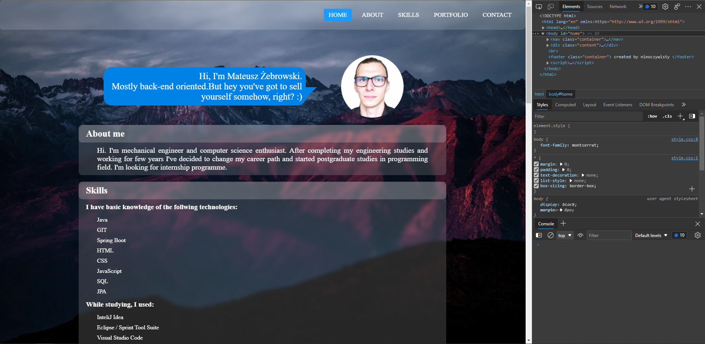

# Welcome-Page
Simple portfolio website.
## Overview
HTML+ CSS on the front. Javascript to call Api's, fetch data and update the page content., Spring boot on the back
URL: nieoczywisty.me -> redirects to app hosted on heroku.
## Known issues:  
-code quality
-resposvivity on mobile browsers.
# What i've learned:
-In the backend I'm using rest template to call external APi
-I've created POJO classes based on JSON returned from API.
-I've made request controller which serves the homepage and data collected from external API.
## Version
v 0.01 -first working state
v 0.02
# Screenshot

